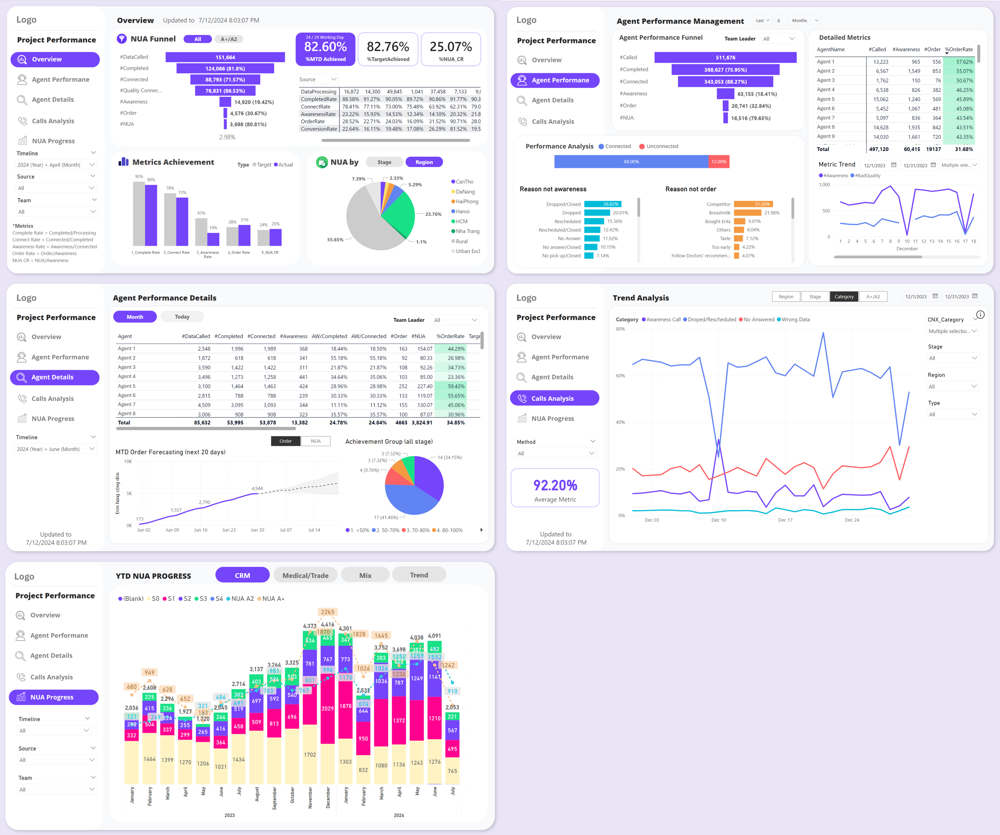
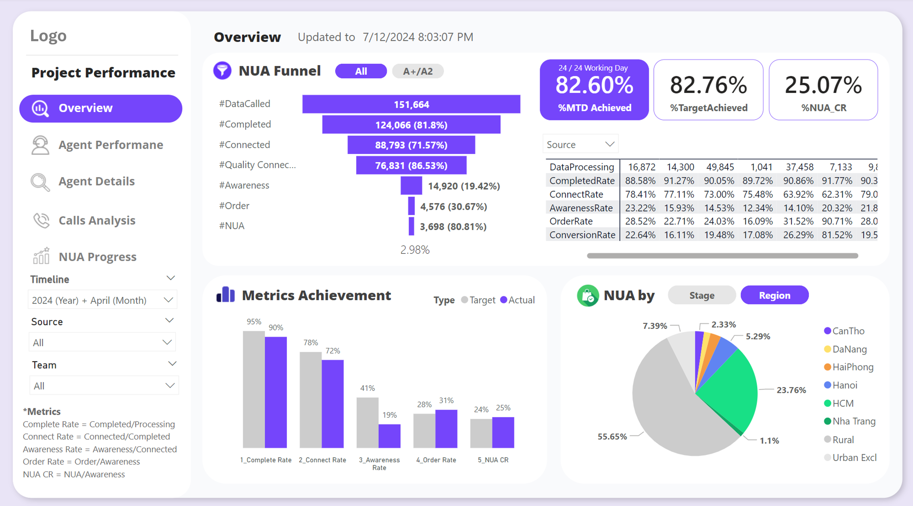
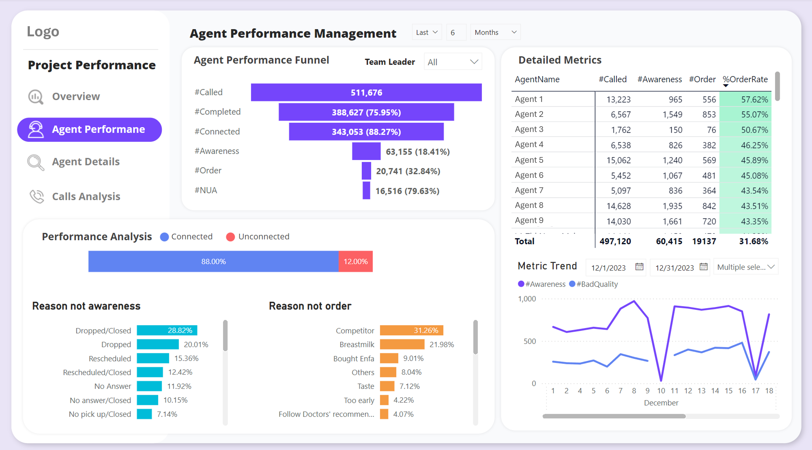
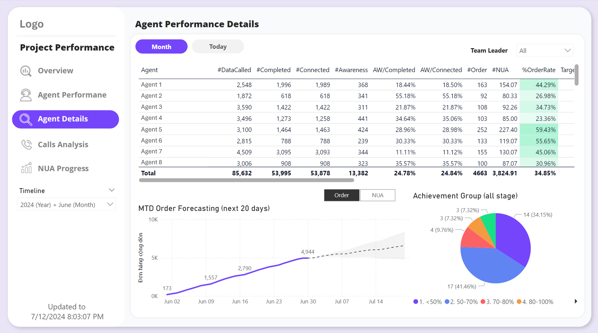
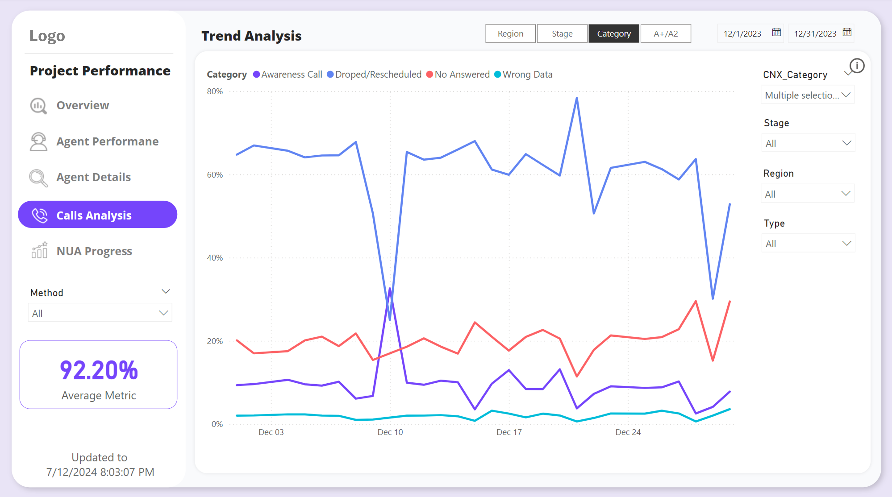
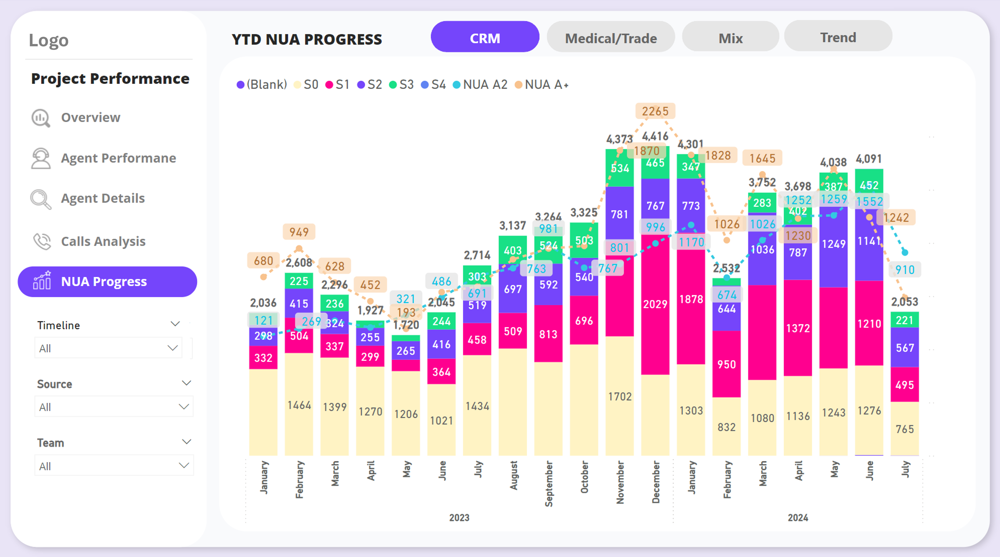

## **Sales Performance Dashboard** (Nutrition Project)

### **Project Description**
* The Sales Performance Dashboard is a comprehensive tool designed with Power BI to provide actionable insights into telesales operations. It features 5 interactive pages, each dedicated to a unique aspect of performance analysis: Overview Analysis, Agent Performance Analysis, Detailed Agent Performance and Forecast, Call Connectivity Analysis, and Performance by Product Lines Over Time.
* With a modern and user-friendly interface, the dashboard seamlessly integrates data from multiple sources, including Salesforce, Excel files, and telesales platforms. It leverages complex transformations using DAX and Power Query to ensure data accuracy and consistency.
* By automating manual reporting processes, the dashboard saves up to 5 hours of manual work each day, allowing teams to focus more on strategic decision-making and improving overall sales performance.

### **Dashboard Sections**
#### **1. Overview Page Description**

The Overview page provides a comprehensive summary of the entire sales process, visualized through multiple components:

* **NUA Funnel**: The funnel chart offers a detailed view of the New User Acquisition (NUA) process, tracking the performance from initial data calls (DataCalled) through various stages to successful sales (NUA). It helps highlight conversion rates at each stage, pinpointing potential drop-offs and areas of improvement.
* **Metrics Achievement**: The column chart displays the key performance indicators (KPIs) for conversion rates, such as Complete Rate, Connect Rate, and NUA CR, allowing quick comparison between target and actual achievements.
* **Score Cards**: Three scorecards at the top highlight the Month-to-Date (MTD) achievement rate, target achievement rate, and NUA conversion rate. These provide a high-level view of the team’s progress against goals.
* **Detailed Data Table**: The table presents granular details for those looking for specific data points, making it easy to analyze the dataset and draw insights.
* **Pie Chart**: This visual breaks down NUA distribution by customer stage and region, offering insights into market penetration strategy and helping track regional performance effectively.

#### **2. Agent Performance Page Description**

The Agent Performance page provides a focused view on individual agent activities and outcomes, assisting team leaders in monitoring their team’s performance effectively:

* **Agent Performance Funnel**: This funnel chart, similar in logic to the NUA funnel on the Overview page, visualizes the team's performance across the sales process, from initial calls to successful NUA conversions. It helps identify bottlenecks at each stage, providing a clear picture of overall team efficiency.
* **Performance Analysis**: The performance bar chart below tracks call connectivity rates and highlights reasons for customer drop-offs or lack of awareness, as well as reasons for non-conversion to orders. This section enables team leaders to understand common challenges and optimize their approach accordingly.
* **Detailed Metrics**: The data table provides an in-depth look at individual agent performance metrics, such as `#Called`, `#Awareness`, and `#Order`, making it easy to assess the contribution of each agent and obtain detailed datasets for further analysis.
* **Metric Trend**: The line chart shows trends of selected metrics over time, allowing the user to observe fluctuations and identify patterns in performance across different time periods. This helps in recognizing impactful factors and making data-driven adjustments to strategy.

#### **3. Agent Details Page Description**

The Agent Details page provides a comprehensive view of individual agent performance, focusing on key metrics and forecasts to aid in effective performance management:

* **Detailed Metrics Data Table**: This large table offers an in-depth view of each agent’s performance, showcasing a variety of metrics such as `#DataCalled`, `#Completed`, `#Connected`, and `#NUA`. The table provides options to switch between monthly and daily views, allowing team leaders to track performance over different timeframes.
* **MTD (Month-To-Date) Order Forecasting Line Chart**: Utilizing linear regression, this chart forecasts the projected order and NUA performance for the remainder of the month based on current trends. The chart helps team leaders and project managers visualize future performance and make necessary adjustments to meet monthly targets.
* **Achievement Group Pie Chart**: This pie chart segments agents into performance groups based on their achievement rates (e.g., `<50%`, `50-70%`, `70-80%`, `80-100%`). The visualization is used by team leaders and project managers to distribute cases and strategize agent assignments effectively, ensuring balanced workloads and targeted performance improvement.

#### **4. Call Analysis Page Description**

The Call Analysis page focuses on tracking the trends in call statuses over time through a single, comprehensive line chart. This chart visualizes how various call statuses (e.g., connected, unconnected, completed) change throughout a selected period.

* **Call Status Trends Line Chart**: The line chart is designed to showcase the trend of call outcomes over time, allowing users to identify patterns, spikes, or drops in call activity.
* **Dynamic Filtering Options**: A set of diverse filters provides flexibility to analyze the trends across multiple dimensions, including customer stage, region, call status category, and product category. This feature enables users to drill down into specific segments, helping to uncover insights and understand the factors driving call performance at a granular level.

#### **5. NUA Progress Page Description**

The NUA Progress page features a single yet powerful visualization: a stacked column chart that illustrates the NUA (successful sales) performance for each product line over time.

* **Stacked Column Chart**: This chart displays the contribution of each product line to the overall sales success, making it easy to see how different products are performing relative to each other throughout the selected period. The stacked format also highlights cumulative sales trends and changes in product popularity.
* **Key Usage**: Despite its simplicity, this page is the most frequently used by team leaders and managers, as it provides a clear view of the ultimate performance trend, helping them make strategic decisions based on the success of each product line.

### **Challenges and Solutions**
#### **1. Multiple and Complex Data Sources**
The dashboard needed to integrate data from various sources such as Salesforce, Excel files, and telesales platforms. This required extensive data transformation and cleaning using Power Query, DAX, and Python to ensure data consistency and accuracy. To address these challenges, I utilized advanced Power Query techniques and wrote custom Python scripts to automate data processing, ensuring that the data could be seamlessly loaded into Power BI.

#### **2. Limited Permissions with Salesforce Data Warehouse**
Due to limitations in querying large volumes of data (under 100k rows at a time), it was difficult to get a comprehensive view of the dataset in one go. To overcome this, I divided the Salesforce data into smaller subsets and saved them as stack files. Additionally, I leveraged SharePoint as a storage solution to house some of the transformed data, enabling efficient data refreshes and maintaining the performance of the dashboard.

#### **3. Scalability and Additional Requests**
Frequent feature requests from leaders and clients necessitated modifications to the dashboard structure, making it crucial to ensure that the solution could accommodate future updates. I tackled this by redesigning the data model to be more modular, enabling easy scalability and flexibility for future enhancements without compromising the existing functionality or performance of the dashboard. This approach significantly improved the adaptability of the dashboard to evolving business needs.

### **Conclusion**
The Sales Performance Dashboard serves as a comprehensive tool for monitoring and analyzing the performance of agents and overall sales trends. By leveraging a blend of Power Query, DAX, and Python, the dashboard seamlessly integrates multiple data sources and presents them in an intuitive and user-friendly interface. Despite challenges like limited access to data and evolving requirements, the final solution is both robust and scalable, allowing team leaders and managers to gain actionable insights quickly and effectively. This project not only saves hours of manual work each day but also empowers decision-makers to plan and strategize more efficiently, making it a valuable asset to the organization’s operational workflow.